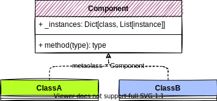
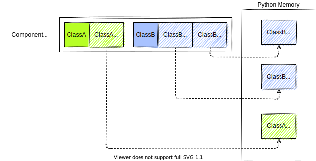
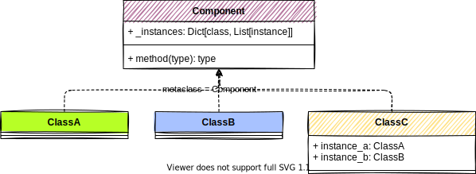
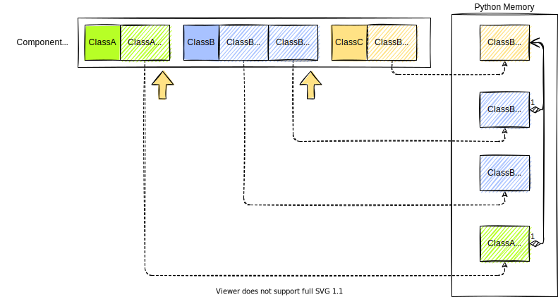
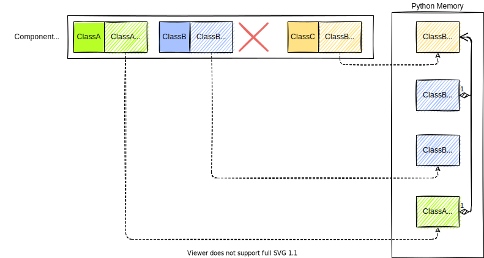

# Memory Model

Below is a description of how memory management is done in `deafadder-container`.
It should help to understand how the correct instance is retrieved and what happens
when a `Component` is deleted.

## 2 Components, no composition

Here we have two `Component` : `ClassA` and `ClassB`. There is no dependency between the two, but each have access
to the instance collection referenced in the metaclass.

```python
from deafadder_container.MetaTemplate import Component


class ClassA(metaclass=Component):
    pass


class ClassB(metaclass=Component):
    pass
```



If we create one instance of `ClassA` and two instances of `ClassB`:
```python
ClassA()
ClassB()
ClassB(instance_name="other_name")
```
We end up with the following memory model:



## A third Component, with composition

Let's have another `Component` that have a depency on the two other class.

```python
from deafadder_container.MetaTemplate import Component
from deafadder_container.Wiring import autowire


class ClassC(metaclass=Component):
    instance_a: ClassA
    instance_b: ClassB

    @autowire(instance_b="other_name")    
    def __init__(self):
        pass

```



Let's create a new instance of `ClassC`:

```python
ClassC()
```

The `Component` metaclass will take care of retrieving the correct instance to inject inside the new
instance of `ClassC`:



## Deletion and impact

Now, when deleting an instance of a `Component` which is referenced somewhere else, the instance is
effectively removed from the collection of reference managed by the `Component` metaclass, but 
not from the process memory.

```python
ClassB.delete(instance_name="other_name")

```


